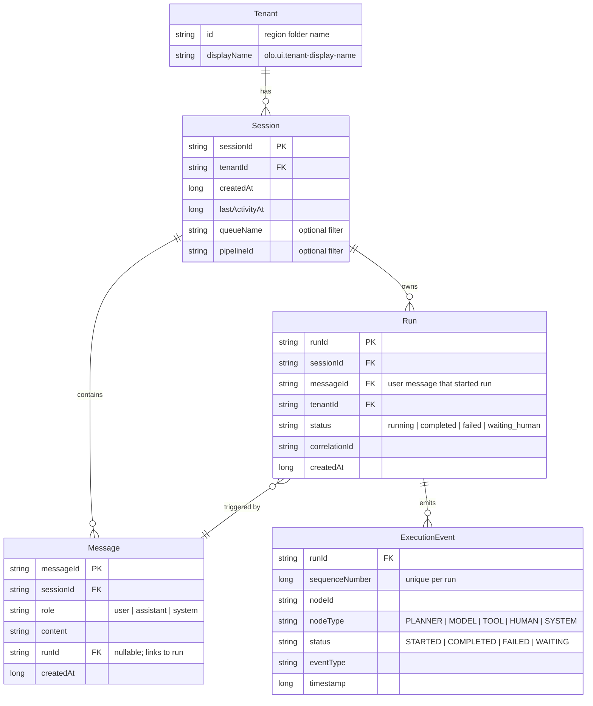

<!--
Copyright (c) 2026 Olo Labs
SPDX-License-Identifier: Apache-2.0
-->

# Data model

Chat entities used by the **olo** backend and how they relate. This complements [ARCHITECTURE.md](./ARCHITECTURE.md) (runtime flows) with entity structure and cardinality.

---

## Entity relationship

**Tenant** is a configuration concept (region folder under `olo.configuration.dir`), not a row in an application database. Sessions carry `tenantId` and scope all chat data for the UI.

```
Tenant                          (from olo.configuration.dir region, e.g. "default")
 └── Session                    (1:N)
      ├── Message               (1:N, ordered per session)
      └── Run                   (1:N)
           └── ExecutionEvent   (1:N, ordered by sequenceNumber)
```

### Mermaid view



---

## Relationships

| From | To | Cardinality | How linked |
|------|-----|-------------|------------|
| **Tenant** | **Session** | 1 : N | `Session.tenantId` matches region id (e.g. `default`) or JWT `tenantId` |
| **Session** | **Message** | 1 : N | `Message.sessionId`; ordered list per session |
| **Session** | **Run** | 1 : N | `Run.sessionId` |
| **Run** | **Message** | 1 : 1 (trigger) | `Run.messageId` → user message created in `POST .../messages` |
| **Message** | **Run** | N : 1 (optional) | `Message.runId`; user, assistant, and human messages for the same turn share one `runId` |
| **Run** | **ExecutionEvent** | 1 : N | `ExecutionEvent.runId`; ordered by `sequenceNumber` |

### Lifecycle (one user send)

1. **Session** already exists (`POST /api/sessions`).
2. **Message** (role `user`) and **Run** are created together when the user sends (`POST /api/sessions/{sessionId}/messages`).
3. **ExecutionEvent** stream starts (`SYSTEM` / `STARTED`, then worker callbacks: `PLANNER`, `MODEL`, `TOOL`, `HUMAN`, …).
4. On model/system completion, an **assistant** **Message** may be appended (same `runId`).
5. On human approval, a **user** or **system** **Message** may be appended for the decision (same `runId`).

Each user send in a session creates **one new Run** and **one new user Message**. A single run can produce **multiple Messages** (user + assistant + human) and **many ExecutionEvents**.

---

## Entities

### Tenant

Not stored in `ChatSessionStore` or Redis as its own record.

| Source | Field | Notes |
|--------|-------|-------|
| Config | `id` | First region folder under `olo.configuration.dir` (e.g. `default`) |
| JWT | `tenantId` | From `Authorization: Bearer` when present |
| UI | `displayName` | `olo.ui.tenant-display-name` |

Exposed via `GET /api/tenants` and `GET /api/ui/context`.

### Session (`ChatSessionStore.SessionRecord`)

A conversation thread for one tenant.

| Field | Type | Description |
|-------|------|-------------|
| `sessionId` | string | UUID primary key |
| `tenantId` | string | Owning tenant |
| `createdAt` | long | Epoch ms |
| `lastActivityAt` | long | Updated on send / assistant persist |
| `queueName` | string? | Optional; used when listing/deleting by preset |
| `pipelineId` | string? | Optional; used when listing/deleting by preset |

**Store:** `ChatSessionStore` (in-memory). **Redis:** `{tenantId}:olo:chat:session:{sessionId}` when Redis is configured.

### Message (`ChatMessageStore.MessageRecord`)

Chat transcript line shown in the UI.

| Field | Type | Description |
|-------|------|-------------|
| `messageId` | string | UUID primary key |
| `sessionId` | string | Parent session |
| `role` | string | `user`, `assistant`, or `system` |
| `content` | string | Message body |
| `runId` | string? | Links message to the run that produced or triggered it |
| `createdAt` | long | Epoch ms |

**Store:** `ChatMessageStore` (in-memory, ordered by session). **Redis:** list at `{tenantId}:olo:chat:messages:{sessionId}`.

### Run (`ChatRunStore.RunRecord`)

One workflow execution for a single user send (one Temporal workflow instance).

| Field | Type | Description |
|-------|------|-------------|
| `runId` | string | UUID; also Temporal workflow id suffix `run-{runId}` |
| `sessionId` | string | Parent session |
| `messageId` | string | User message that started this run |
| `tenantId` | string | Used for WebSocket `SUBSCRIBE_RUN` tenant check |
| `status` | string | `running`, `completed`, `failed`, `waiting_human` (derived from events) |
| `correlationId` | string | Tracing id propagated to all events |
| `workflowVersion` / `modelVersion` / `plannerVersion` | string? | Execution versioning metadata |
| `createdAt` | long | Epoch ms |

**Store:** `ChatRunStore` (in-memory only). **Not persisted to Redis** — lost on backend restart.

### ExecutionEvent (`OloExecutionEvent`)

Append-only execution log for a run. Drives SSE/WebSocket UI (progress, thinking, human prompts, completion).

| Field | Type | Description |
|-------|------|-------------|
| `runId` | string | Parent run |
| `sequenceNumber` | long | Unique per run; ordering key |
| `nodeId` | string | Workflow node id |
| `parentNodeId` | string? | Parent node in workflow graph |
| `nodeType` | enum | `PLANNER`, `MODEL`, `TOOL`, `HUMAN`, `SYSTEM` |
| `status` | enum | `STARTED`, `COMPLETED`, `FAILED`, `WAITING` |
| `eventType` | enum | `NODE_STARTED`, `NODE_COMPLETED`, `NODE_FAILED`, `NODE_WAITING` |
| `timestamp` | long | Epoch ms |
| `correlationId` | string | Same as run when set at creation |
| `input` / `output` / `metadata` | map | Node payload and extras |

**Store:** `ExecutionEventStore` (in-memory only). Idempotency: duplicate `(runId, sequenceNumber)` throws `DuplicateSequenceException`.

**Producers:** backend on send (`SYSTEM` start), worker via `POST /api/runs/{runId}/events`, completion callback in `RunServiceImpl`.

---

## Persistence summary

| Entity | In-memory | Redis | Survives restart |
|--------|-----------|-------|------------------|
| Tenant | — (config) | — | Yes (config files) |
| Session | Yes | Yes | Yes (if Redis up) |
| Message | Yes | Yes | Yes (if Redis up) |
| Run | Yes | No | No |
| ExecutionEvent | Yes | No | No |

After a backend restart with Redis: **sessions and messages** reload; **runs and events** for in-flight work are gone. Clients must rely on persisted messages and start new runs for new sends.

---

## Store mapping

| Store class | Entity | Key |
|-------------|--------|-----|
| `ChatSessionStore` | Session | `sessionId` |
| `ChatMessageStore` | Message | `messageId`; index `sessionId → [messageId…]` |
| `ChatRunStore` | Run | `runId` |
| `ExecutionEventStore` | ExecutionEvent | `runId → sequenceNumber` |
| `ChatRedisPersistence` | Session, Message | Redis keys per tenant (see above) |

---

## Related docs

- [ARCHITECTURE.md](./ARCHITECTURE.md) — API and chat/run data flow
- [FAILURE_RECOVERY.md](./FAILURE_RECOVERY.md) — What happens when Redis or the backend restarts mid-run
- [README.md](./README.md) — Quick start and API index
